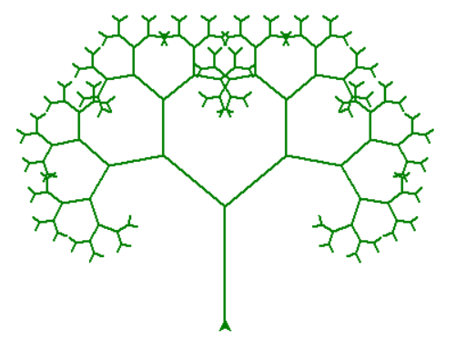

# goit-algo-fp

# 1. Встановлення
## Перш ніж почати, переконайтеся, що у вас встановлено Python 3 і pip. Далі встановіть необхідні пакети, використовуючи команду:
```bash
pip install -r requirements.txt
```
або
```bash
pip3 install -r requirements.txt
```

# 2. Опис та пояснення виконання завдань

## Task 1
В першому завданні реалізовано структуру даних однозв'язного списку та набір операцій над ним, таких як вставка, видалення, пошук, реверсування, сортування та об'єднання відсортованих списків.
### Методи для роботи зі списками

- `insert_at_beginning(data)`: Додає новий вузол на початок списку.
- `insert_at_end(data)`: Додає новий вузол в кінець списку.
- `insert_after(prev_node, data)`: Додає новий вузол після певного вузла.
- `delete_node(key)`: Видаляє вузол зі списку за значенням ключа.
- `search_element(data)`: Пошук вузла за значенням.
- `print_list()`: Виведення всього списку.
- `reverse()`: Реверсує список, змінюючи посилання між вузлами.
- `insertion_sort()`: Сортує список за допомогою алгоритму сортування вставками.
- `merge_sorted_lists(other)`: Об'єднує два відсортованих списки в один відсортований список.

### Результат:
Новий зв'язний список:
[15, 5, 10, 25, 20]

Реверсування однозв'язного списку:
[20, 25, 10, 5, 15]

Сортування однозв'язного списку:
[5, 10, 15, 20, 25]

Об'єднує два відсортовані однозв'язні списки:
[16, 21, 26, 31, 36] та [5, 10, 15, 20, 25]: [5, 10, 15, 16, 20, 21, 25, 26, 31, 36]

## Task 2
В цьому завданні реалізовано алгоритм малювання фрактального дерева Піфагора з використанням модуля Turtle. Основні можливості коду включають:

- **draw_pifagor_tree**: Рекурсивна функція для малювання гілок дерева. Вона приймає довжину гілки, об'єкт Turtle, кут повороту та рівень рекурсії. На кожному рівні рекурсії функція малює дві гілки меншого розміру.
- **Введення рівня рекурсії**: Користувач може задати рівень рекурсії через консоль. Якщо рівень не вказаний, за замовчуванням використовується рівень 5.
- **Налаштування Turtle**: Створюється об'єкт Turtle для малювання, встановлюється початкова швидкість, колір та ширина пера. Turtle повертається на 90 градусів для початку малювання дерева вертикально вгору.

Код візуалізує фрактальне дерево (нижче на малюнку), де кожна гілка ділиться на дві менші гілки, створюючи красиву симетричну структуру:



## Task 3
В третьому завданні реалізовано алгоритм Дейкстри для знаходження найкоротших шляхів у зваженому графі, що складається з міст та ребер з вказаними вагами. Результати виводяться у зручному форматі для подальшого аналізу та використання.

#### Виконані дії

- Створено граф з містами та ребрами, де кожне ребро має вагу.
- Реалізовано алгоритм Дейкстри для обчислення найкоротших шляхів від кожного міста до всіх інших у графі.
- Виведено результати у вигляді таблиці, що включає найкоротші відстані та сумарні відстані для кожного міста.

### Результат:
Найкоротші шляхи: 7707

| Міста         | Kyiv (0) | Berlin (1292) | Prague (1389) | Vienna (1514) | Amsterdam (1869) | Paris (2170) | London (2226) | Rome (2280) | Madrid (3224) | Сума   |
|:--------------|---------:|--------------:|--------------:|--------------:|------------------:|-------------:|--------------:|------------:|--------------:|-------:|
| Kyiv          |        0 |          1292 |          1389 |          1514 |              1869 |         2170 |          2226 |        2280 |          3224 |  15964 |
| Paris         |        0 |           344 |           701 |           878 |              1054 |         1158 |          1402 |        1423 |          2170 |   9130 |
| Berlin        |        0 |           280 |           524 |           577 |               878 |          934 |          1290 |        1292 |          1932 |   7707 |
| Rome          |        0 |           766 |          1017 |          1290 |              1423 |         1725 |          1767 |        2280 |          2477 |  12745 |
| Madrid        |        0 |          1054 |          1398 |          1755 |              1932 |         2212 |          2456 |        2477 |          3224 |  16508 |
| London        |        0 |           344 |           357 |           934 |              1065 |         1316 |          1398 |        1767 |          2226 |   9407 |
| Amsterdam     |        0 |           357 |           577 |           701 |               708 |          959 |          1725 |        1755 |          1869 |   8651 |
| Prague        |        0 |           251 |           280 |           708 |              1017 |         1065 |          1158 |        1389 |          2212 |   8080 |
| Vienna        |        0 |           251 |           524 |           766 |               959 |         1316 |          1402 |        1514 |          2456 |   9188 |


## Task 4
В цьому завданні створено бінарну купу з вказаних елементів і відображено її у вигляді графіку.

Ви можете змінювати масив elements, щоб створювати та візуалізувати різні бінарні купи.

Доступні функції:
- `add_edges`: Рекурсивна функція для додавання ребер між вузлами в графі та позиціонування вузлів для візуалізації.
- `draw_tree`: Функція для візуалізації дерева за допомогою NetworkX та Matplotlib.
- `insert_to_heap`: Функція для вставки нового елементу в бінарну купу.
- `build_heap`: Функція для побудови бінарної купи з масиву елементів.

Результат:


## Task 5

В п'ятому завданні створено два окремих графіка для кожного алгоритму обходу бінарного дерева (BFS і DFS):


Колір вузлів у візуалізації змінюється від часу обходу двома алгоритмами (BFS і DFS) через те, що кожен алгоритм встановлює кольори вузлів на основі кроку алгоритму. У DFS кольори змінюються рекурсивно, від верхніх рівнів до нижніх, тоді як у BFS кольори змінюються поетапно, рівень за рівнем, від кореня до листя.

## Task 6

### Жадібний алгоритм та алгоритм динамічного програмування

В цьому завданні порівнюється робота двох алгоритмів оптимізації вибору предметів для заданого бюджету: жадібного алгоритму та алгоритму на основі динамічного програмування.

Результати:

#### Результати для бюджету 25

- **Алгоритм Жадібний:**
  - Обрані предмети: ['cola', 'pepsi']
  - Загальна калорійність: 320
  - Загальна вартість: 25 

- **Алгоритм Динамічне програмування:**
  - Обрані предмети: ['potato']
  - Загальна калорійність: 350
  - Загальна вартість: 25 

#### Результати для бюджету 50

- **Алгоритм Жадібний:**
  - Обрані предмети: ['cola', 'potato', 'pepsi']
  - Загальна калорійність: 670
  - Загальна вартість: 50 

- **Алгоритм Динамічне програмування:**
  - Обрані предмети: ['pepsi', 'cola', 'potato']
  - Загальна калорійність: 670
  - Загальна вартість: 50 

#### Результати для бюджету 75

- **Алгоритм Жадібний:**
  - Обрані предмети: ['cola', 'potato', 'pepsi']
  - Загальна калорійність: 670
  - Загальна вартість: 50 

- **Алгоритм Динамічне програмування:**
  - Обрані предмети: ['hot-dog', 'cola', 'potato']
  - Загальна калорійність: 770
  - Загальна вартість: 70 

#### Результати для бюджету 100

- **Алгоритм Жадібний:**
  - Обрані предмети: ['cola', 'potato', 'pepsi', 'hot-dog']
  - Загальна калорійність: 870
  - Загальна вартість: 80 

- **Алгоритм Динамічне програмування:**
  - Обрані предмети: ['pizza', 'pepsi', 'cola', 'potato']
  - Загальна калорійність: 970
  - Загальна вартість: 100 

### Різні підходи в виборі страв:

- **Жадібний алгоритм:** Обирає страви на основі максимального співвідношення калорійності до вартості.
- **Динамічне програмування:** Розглядає всі можливі комбінації страв для знаходження максимальної кількості калорій за заданий бюджет.

### Висновок:

Для максимізації кількості калорій рекомендується використовувати динамічне програмування, особливо при великому бюджеті або коли декілька страв мають схожі витрати на вартість. Жадібний алгоритм може бути використаний для швидкого отримання результату, але не завжди гарантує оптимальність вибору страв за кількістю калорій.

## Task 7

Цей код симулює кидки двох кубиків, обчислює ймовірності, порівнює їх із теоретичними значеннями та виводить результати у вигляді таблиці та стовпчикового графіку.

#### Табличний вигляд:

| Сума | Симульована імовірність (%) | Теоретична імовірність (%) |
|------|-----------------------------|----------------------------|
|  2   |          2.79               |          2.78              |
|  3   |          5.56               |          5.56              |
|  4   |          8.35               |          8.33              |
|  5   |         11.03               |         11.11              |
|  6   |         13.87               |         13.89              |
|  7   |         16.65               |         16.67              |
|  8   |         13.93               |         13.89              |
|  9   |         11.07               |         11.11              |
| 10   |          8.35               |          8.33              |
| 11   |          5.59               |          5.56              |
| 12   |          2.80               |          2.78              |

#### Графічний вигляд:


Стовпчиковий графік має два набори стовпчиків для кожної суми: один для симульованих ймовірностей і один для теоретичних ймовірностей, що дозволяє легко порівняти результати.

### Причини різниці між симульованими і теоретичними ймовірностями:

- **Випадковість у симуляції:** Результати симуляції завжди будуть мати деякі відхилення від теоретичних значень через випадковий характер процесу. Навіть при великій кількості симуляцій (в даному випадку 1 000 000) існує ймовірність невеликих статистичних флуктуацій.
- **Кількість симуляцій:** Хоча ми провели 1 000 000 симуляцій, це все ще обмежена кількість. Збільшення кількості симуляцій ще більше зменшить різницю між симульованими і теоретичними ймовірностями.
- **Обчислювальні обмеження:** Кожна симуляція використовує генератор випадкових чисел, який працює на основі певного алгоритму. Хоча ці генератори дуже добрі, вони все ще можуть вносити невеликі похибки.

В цілому, різниця між симульованими і теоретичними ймовірностями є очікуваною і нормальною. Вона підтверджує правильність теоретичних розрахунків та демонструє, що симуляційний підхід добре наближає теоретичні значення ймовірностей.
